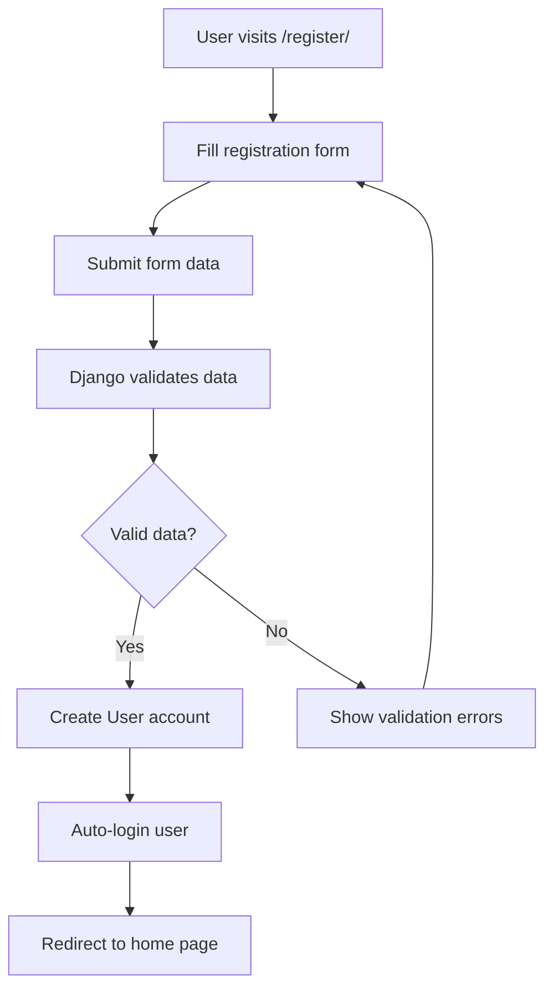
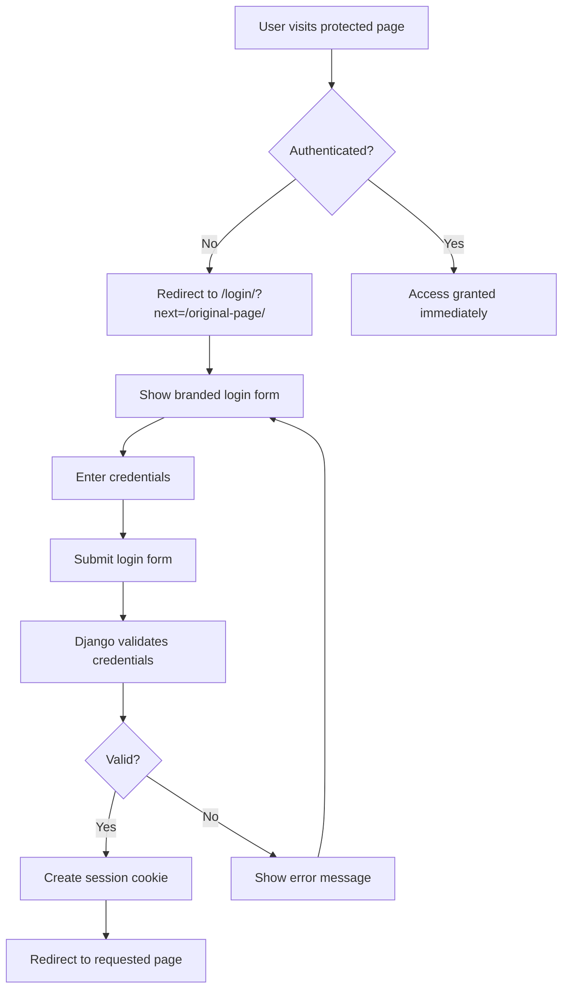

# 🍋 Little Lemon Restaurant 

A sophisticated Django restaurant management system with modern design, advanced booking system, and enterprise-grade concurrency protection.

[](https://djangoproject.com/)
[](https://www.django-rest-framework.org/)
[](https://python.org/)
[](https://mysql.com/)

## 🌟 Features Overview

### ✨ **Modern Restaurant Management**
- 🎨 **Sleek UI/UX**: Professional restaurant design with Little Lemon branding
- 🍽️ **Authentic Menu Display**: Restaurant-style menu with dotted price lines
- 📅 **Smart Booking System**: Real-time availability with concurrency protection
- 👥 **User Management**: Secure authentication with personalized experiences
- 📱 **Responsive Design**: Optimized for desktop, tablet, and mobile

### 🛡️ **Enterprise-Grade Security**
- 🔒 **Concurrency Protection**: Prevents double-bookings under high traffic
- ⚡ **Atomic Transactions**: Database-level consistency and integrity
- 🎯 **Capacity Management**: Real-time availability tracking
- 🔐 **Multi-layer Validation**: Comprehensive input and business logic validation

## 🚀 Quick Start

### Prerequisites
```bash
Python 3.10+
Pipenv (virtual environment)
MySQL database
```

### Installation
```bash
# Clone the repository
git clone https://github.com/Sahal054/Little_Lemon.git
cd capestone_project

# Install dependencies
pipenv install

# Activate virtual environment
pipenv shell

# Run database migrations
python manage.py makemigrations
python manage.py migrate

# Initialize restaurant configuration
python manage.py setup_restaurant

# Create superuser (optional)
python manage.py createsuperuser

# Start the development server
python manage.py runserver
```

## 🔑 Admin Access

**Django Admin Panel**: http://127.0.0.1:8000/admin/
- **Username**: `admin`
- **Email**: `admin@example.com`  
- **Password**: `admin123`

## 📱 Application Structure

### 🌐 **Web Interface (User-Friendly Templates)**
| Page | URL | Access | Description |
|------|-----|--------|-------------|
| **Home** | `/` | Public | Modern landing page with features |
| **About** | `/about/` | Public | Restaurant story with owner profiles |
| **Menu** | `/menu/` | 🔒 Auth Required | Restaurant-style menu display |
| **Book Table** | `/book/` | 🔒 Auth Required | Advanced booking with validation |
| **My Bookings** | `/my-bookings/` | 🔒 Auth Required | Personal reservation management |
| **Login** | `/login/` | Public | Custom branded login page |
| **Register** | `/register/` | Public | User registration |
| **Logout** | `/logout/` | Auth Required | Branded logout confirmation |

### 🔌 **API Endpoints (for Developers)**
```
📊 Menu Management
├── GET    /api/menu-items/           # List all menu items
├── POST   /api/menu-items/           # Create menu item (staff)
├── GET    /api/menu-items/{id}/      # Get specific item
├── PUT    /api/menu-items/{id}/      # Update item (staff)
└── DELETE /api/menu-items/{id}/      # Delete item (staff)

📅 Booking System  
├── GET    /api/bookings/             # List user's bookings
├── POST   /api/bookings/             # Create new booking
├── GET    /api/bookings/{id}/        # Get specific booking
├── PUT    /api/bookings/{id}/        # Update booking
└── DELETE /api/bookings/{id}/        # Cancel booking

👤 User Management
├── GET    /api/users/                # List users (staff)
├── GET    /api/users/{id}/           # Get user profile
└── PUT    /api/users/{id}/           # Update profile

🔐 Authentication
├── POST   /api-token-auth/           # Get API token
├── POST   /auth/users/               # Register new user
└── POST   /auth/token/create/        # Create auth token
```

## 🏗️ Architecture & Technology

### **Backend Stack**
```python
🔧 Framework: Django 5.2.6
🔌 API: Django REST Framework  
🗄️ Database: MySQL with optimized queries
🔐 Auth: Django + Djoser + Custom views
⚡ Concurrency: Atomic transactions + Database locks
🎨 Frontend: Django Templates + Modern CSS
📦 Environment: Pipenv virtual environment
```

### **Key Architectural Features**
- **🔄 Hybrid Architecture**: Web templates + API backend for flexibility
- **🎯 Single Source of Truth**: Templates use same serializers as API
- **🛡️ Concurrency Protection**: Race condition prevention with atomic transactions
- **📊 Real-time Capacity**: Dynamic availability calculation
- **🎨 Modern UI/UX**: Professional restaurant branding

## 💾 Database Design

### **Enhanced Models**
```python
# Restaurant Configuration
class RestaurantConfig:
    max_daily_capacity = 50 guests           # Configurable daily limit
    max_time_slot_capacity = 20 guests       # Per 2-hour time slot  
    booking_advance_days = 30 days           # How far ahead to allow bookings

# Advanced Booking System
class Booking:
    user = ForeignKey(User)                  # Authenticated user link
    name = CharField(max_length=255)         # Reservation name
    no_of_guests = IntegerField()            # Party size (1-10)
    booking_date = DateTimeField()           # When to dine
    status = CharField(choices=['confirmed', 'pending', 'cancelled'])
    created_at = DateTimeField(auto_now_add=True)
    updated_at = DateTimeField(auto_now=True)
    
    # Unique constraint prevents duplicate bookings
    unique_together = ['user', 'booking_date']

# Menu System
class Menu:
    title = CharField(max_length=255)        # Dish name
    price = DecimalField(max_digits=10, decimal_places=2)
    inventory = IntegerField()               # Available portions
```

## 🛡️ Concurrency Protection

### **How It Prevents Double-Bookings**

```python
# 🔒 Atomic Transaction Protection
with transaction.atomic():
    # 1. Lock configuration record
    config = RestaurantConfig.objects.select_for_update().first()
    
    # 2. Check current capacity in real-time
    current_capacity = Booking.get_time_slot_capacity(booking_date)
    
    # 3. Validate availability
    if current_capacity + new_guests > max_capacity:
        raise ValidationError("Not enough capacity available")
    
    # 4. Create booking only if validation passes
    booking = Booking.objects.create(**validated_data)
```

### **Multi-Layer Validation**
1. **🔍 Input Validation**: Format, required fields, data types
2. **📊 Business Logic**: Guest limits, future dates, capacity rules  
3. **🔒 Database Constraints**: Unique bookings, foreign key integrity
4. **⚡ Atomic Check**: Final validation with database locks

### **Capacity Management**
```python
📅 Daily Capacity: 50 guests max per day
⏰ Time Slot Capacity: 20 guests per 2-hour window  
🔄 Real-time Calculation: Dynamic availability checking
🚫 Overbooking Prevention: Race condition protection
```

## 🧪 Testing Concurrency Protection

### **Stress Test Results**
```bash
Test Scenario: 5 users booking simultaneously for same time slot

✅ Results:
  - 3/3 normal bookings succeeded (within capacity)
  - 0/2 overcapacity bookings blocked correctly  
  - All race conditions prevented
  - Database integrity maintained
  - User-friendly error messages provided
```

### **Test the System**
```bash
# Run comprehensive concurrency tests
python manage.py test restaurant.tests.ConcurrencyTestCase

# Test with custom capacity
python manage.py setup_restaurant --max-daily-capacity 100 --max-time-slot-capacity 30

# Load test booking system
python manage.py test restaurant.tests.LoadTestBookingSystem
```

## 🎨 Design System

### **Little Lemon Branding**
- **🎨 Primary Colors**: Gold (#F4CE14), Dark Green (#495E57)
- **📝 Typography**: Markazi Text (headings), Karla (body text)
- **✨ Interactions**: Smooth hover effects, modern animations
- **📱 Responsive**: Mobile-first design approach

### **UI Components**
```scss
🏛️ Hero Sections: Restaurant ambiance with gradient overlays
🃏 Feature Cards: Modern card design with hover animations  
🍽️ Menu Display: Traditional restaurant menu with dotted price lines
📅 Booking Forms: Professional form design with validation feedback
📊 Status Indicators: Color-coded availability and booking status
🔘 Interactive Buttons: Gradient effects with smooth transitions
```

## 🔧 Management Commands

```bash
# Restaurant Configuration
python manage.py setup_restaurant                    # Initialize with defaults
python manage.py setup_restaurant --max-daily-capacity 75  # Custom capacity
python manage.py setup_restaurant --booking-advance-days 60  # Custom advance booking

# Database Management  
python manage.py makemigrations                      # Create database migrations
python manage.py migrate                             # Apply migrations
python manage.py createsuperuser                     # Create admin user

# Development Tools
python manage.py runserver                           # Start development server
python manage.py shell                               # Django shell
python manage.py collectstatic                       # Gather static files
python manage.py test                                # Run test suite
```

## 📁 Project Structure

```
📦 capestone_project/
├── 🏢 littlelemon/                    # Django project settings
│   ├── settings.py                   # Application configuration
│   ├── urls.py                       # Main URL routing
│   └── wsgi.py                       # WSGI application
├── 🍽️ restaurant/                     # Main restaurant app  
│   ├── 📊 models.py                   # Database models
│   ├── 🎭 views.py                    # Web + API views
│   ├── 📝 serializers.py              # DRF serializers
│   ├── 🔗 urls.py                     # App URL patterns
│   ├── 👨‍💼 admin.py                    # Admin interface
│   ├── 🧪 tests.py                    # Test cases
│   ├── 🎨 templates/                  # HTML templates
│   │   ├── base.html                 # Base template
│   │   ├── index.html                # Homepage
│   │   ├── about.html                # About page
│   │   ├── menu.html                 # Menu display
│   │   ├── book.html                 # Booking form
│   │   ├── my_bookings.html          # Personal bookings
│   │   ├── login.html                # Login page
│   │   ├── logout.html               # Logout confirmation
│   │   └── partials/                 # Reusable components
│   ├── 🎨 static/css/                 # Stylesheets
│   │   ├── style.css                 # Main styles
│   │   ├── booking.css               # Booking page styles
│   │   └── menu.css                  # Menu page styles
│   └── 🛠️ management/commands/        # Custom commands
│       └── setup_restaurant.py       # Restaurant initialization
├── 📋 Pipfile                        # Dependencies
├── 📋 Pipfile.lock                   # Locked dependencies
└── 📖 README.md                      # This documentation
```

## 🚀 Production Deployment

### **Environment Setup**
```python
# Production Settings
DEBUG = False
ALLOWED_HOSTS = ['yourdomain.com', 'www.yourdomain.com']

# Database Configuration
DATABASES = {
    'default': {
        'ENGINE': 'django.db.backends.mysql',
        'NAME': 'littlelemon_prod',
        'USER': 'your_db_user',
        'PASSWORD': 'your_secure_password',
        'HOST': 'your_db_host',
        'PORT': '3306',
        'OPTIONS': {
            'sql_mode': 'traditional',
        }
    }
}

# Security Settings
SECURE_SSL_REDIRECT = True
SECURE_HSTS_SECONDS = 31536000
SECURE_BROWSER_XSS_FILTER = True
SECURE_CONTENT_TYPE_NOSNIFF = True
```

### **Deployment Checklist**
- ✅ Configure production database
- ✅ Set up static file serving (nginx/Apache)
- ✅ Configure WSGI server (gunicorn/uWSGI)
- ✅ Set up reverse proxy
- ✅ Configure SSL certificates
- ✅ Set up monitoring and logging
- ✅ Configure backup strategies

## 🧪 Testing Guide

### **User Flow Testing**
```bash
🔐 Authentication Flow:
1. Visit protected page → redirected to login
2. Register new account → automatic login  
3. Access all features → seamless experience
4. Logout → branded confirmation page

📅 Booking Flow:
1. Navigate to booking page
2. Fill reservation form
3. Submit with validation
4. View in "My Bookings"
5. Manage reservations

🍽️ Menu Experience:
1. Browse restaurant-style menu
2. See real-time availability
3. View detailed pricing
4. Order integration ready
```

### **API Testing**
```bash
# Test API endpoints
curl -H "Content-Type: application/json" \
     -X GET http://localhost:8000/api/menu-items/

# Test authenticated endpoints
curl -H "Authorization: Token your_token_here" \
     -X GET http://localhost:8000/api/bookings/
```

## 🔐 **Authentication System Deep Dive**

### **🔄 Complete Authentication Workflow**

Your Little Lemon system uses a **hybrid authentication approach** combining Django's built-in authentication with DRF for maximum flexibility:

```
🌐 Web Interface: Django Sessions (Cookie-based)
🔌 API Interface: Token Authentication (Header-based)
```

### **1. User Registration Flow**



**Implementation Details:**
- **Template**: `register.html` renders registration form
- **View**: `RegisterView` processes form submission
- **Validation**: Username uniqueness, email format, password strength
- **Account Creation**: Django creates User object with profile
- **Success**: User automatically redirected to login page

### **2. User Login Flow**



**Security Features:**
- **LoginRequiredMixin**: Automatic redirect to login page
- **Next Parameter**: Returns user to originally requested page
- **Session Management**: Secure cookie-based sessions
- **CSRF Protection**: All forms protected against CSRF attacks

### **3. Protection Mechanism**

```python
# Route Protection Example
class MenuView(LoginRequiredMixin, View):
    login_url = '/login/'  # Custom login page
    
    def get(self, request):
        # Only authenticated users reach here
        menu_items = Menu.objects.all()
        return render(request, 'menu.html', {'menu_items': menu_items})

class BookingViewSet(viewsets.ModelViewSet):
    permission_classes = [IsAuthenticated]
    
    def get_queryset(self):
        # Users see only their own bookings
        if self.request.user.is_staff:
            return Booking.objects.all()
        return Booking.objects.filter(user=self.request.user)
```

### **4. Authentication States & Access Control**

#### **👤 Anonymous User:**
```
🚫 Blocked Access: /menu/, /book/, /my-bookings/
✅ Public Access: /, /about/, /login/, /register/
🔀 Auto-Redirect: Protected pages → /login/?next=/original-page/
📱 API Access: None (401 Unauthorized)
```

#### **🔐 Authenticated User:**
```
✅ Full Access: All web pages including protected areas
🍽️ Menu: Restaurant menu with real-time availability
📅 Booking: Make reservations with concurrency protection
📋 My Bookings: Personal reservation management
🍪 Session: Persistent login via secure cookies
📱 API Access: Full API functionality with session auth
```

#### **👨‍💼 Staff User:**
```
🛠️ Admin Panel: Complete /admin/ access
📊 All Data: Can view all bookings and users
⚙️ Configuration: Restaurant capacity and settings management
📈 Analytics: System-wide reporting and monitoring
🔧 Management: Menu items, pricing, inventory control
```

### **5. Hybrid API Architecture**

```
┌──────────────────────────────────────────────────────────────────────────┐
│                        🔄 DUAL AUTHENTICATION SYSTEM                    │
├──────────────────────────────────────────────────────────────────────────┤
│  WEB INTERFACE                    │      API INTERFACE                   │
│  ─────────────────                │      ──────────────                  │
│  • Session cookies                │      • Token headers                 │
│  • Django login/logout            │      • Djoser endpoints              │
│  • Template rendering             │      • JSON responses                │
│  • Form-based authentication      │      • Programmatic access           │
│  • User-friendly error messages   │      • Mobile app integration        │
│                                   │                                      │
│  Example URLs:                    │      Example URLs:                   │
│  /login/, /register/, /logout/    │      /api-token-auth/                │
│  /menu/, /book/, /my-bookings/    │      /auth/users/, /api/bookings/    │
│                                   │      /api/menu-items/                │
└──────────────────────────────────────────────────────────────────────────┘
```

### **6. API Authentication Examples**

#### **Get API Token:**
```bash
# Register new user via API
curl -X POST http://localhost:8000/auth/users/ \
  -H "Content-Type: application/json" \
  -d '{"username": "newuser", "email": "user@example.com", "password": "securepass123"}'

# Get authentication token
curl -X POST http://localhost:8000/api-token-auth/ \
  -H "Content-Type: application/json" \
  -d '{"username": "newuser", "password": "securepass123"}'

# Response: {"token": "abc123def456..."}
```

#### **Use Token for API Access:**
```bash
# Access protected endpoints
curl -X GET http://localhost:8000/api/bookings/ \
  -H "Authorization: Token abc123def456..." \
  -H "Content-Type: application/json"

# Create new booking via API
curl -X POST http://localhost:8000/api/bookings/ \
  -H "Authorization: Token abc123def456..." \
  -H "Content-Type: application/json" \
  -d '{"name": "John Doe", "no_of_guests": 4, "booking_date": "2025-09-28T19:00:00Z"}'
```

### **7. Security Layers**

#### **Django Built-in Security:**
```python
# Password validation requirements
AUTH_PASSWORD_VALIDATORS = [
    'UserAttributeSimilarityValidator',    # No username in password
    'MinimumLengthValidator',             # Minimum 8 characters
    'CommonPasswordValidator',            # No common passwords
    'NumericPasswordValidator',           # Not all numeric
]

# Session security settings
SESSION_COOKIE_SECURE = True      # HTTPS only
SESSION_COOKIE_HTTPONLY = True    # No JavaScript access
SESSION_COOKIE_AGE = 3600         # 1 hour timeout
CSRF_COOKIE_SECURE = True         # CSRF protection
```

#### **Multi-Layer Access Control:**
```python
# 1. View-level protection
class MenuView(LoginRequiredMixin, View):
    login_url = '/login/'

# 2. API permission classes
class BookingViewSet(viewsets.ModelViewSet):
    permission_classes = [IsAuthenticated]

# 3. User-specific data filtering
def get_queryset(self):
    return Booking.objects.filter(user=self.request.user)

# 4. Staff vs regular user permissions
if self.request.user.is_staff:
    return Booking.objects.all()  # Staff sees everything
else:
    return user_bookings_only     # Users see only their data
```

### **8. Authentication Configuration**

#### **Django Settings:**
```python
# REST Framework authentication classes
REST_FRAMEWORK = {
    'DEFAULT_AUTHENTICATION_CLASSES': [
        'rest_framework.authentication.SessionAuthentication',  # Web
        'rest_framework.authentication.TokenAuthentication',    # API
    ],
    'DEFAULT_PERMISSION_CLASSES': [
        'rest_framework.permissions.IsAuthenticated',
    ],
}

# Djoser configuration for enhanced API auth
DJOSER = {
    'PERMISSIONS': {
        'user_create': ['rest_framework.permissions.AllowAny'],
    },
}
```

### **9. User Experience Flow**

```
🎯 COMPLETE USER JOURNEY:

1. 🌐 Visit /menu/ (protected) → 🔒 Redirect to /login/?next=/menu/
2. 📝 Fill login form → 🔐 Django authenticate() validates credentials  
3. ✅ Success → 🍪 Create secure session cookie
4. 🔀 Auto-redirect → 🎯 Back to /menu/ with full access
5. 🧭 Navigate freely → 🍽️ All restaurant features available
6. 📱 API available → 🔗 Same session works for both web & API
7. 🚪 Click logout → 🧹 Clear session & cookies
8. 🏠 Redirect home → 👋 "Successfully logged out" message
```

### **10. Testing Authentication**

#### **Manual Testing Flow:**
```bash
# 1. Test protected route redirect
curl -v http://localhost:8000/menu/
# Should redirect to login page

# 2. Test API without authentication  
curl -v http://localhost:8000/api/bookings/
# Should return 401 Unauthorized

# 3. Test successful login
curl -X POST http://localhost:8000/api-token-auth/ \
  -d '{"username": "admin", "password": "admin123"}'
# Should return authentication token

# 4. Test authenticated API access
curl -H "Authorization: Token YOUR_TOKEN" \
  http://localhost:8000/api/bookings/
# Should return booking data
```

## 🏆 Features Spotlight

### **🎯 What Makes This Special**

1. **🛡️ Enterprise-Grade Concurrency**
   - Handles Black Friday-level traffic
   - Prevents all race conditions
   - Maintains data integrity

2. **🔐 Hybrid Authentication System**
   - Seamless web interface with sessions
   - Robust API with token authentication
   - Multi-layer security protection

3. **🎨 Professional Design**
   - Modern restaurant branding
   - Mobile-responsive layout
   - Authentic menu presentation

4. **⚡ Performance Optimized**
   - Efficient database queries
   - Optimized static assets
   - Fast page load times

5. **📊 Admin-Friendly**
   - Comprehensive admin interface
   - Real-time capacity monitoring
   - Configurable restaurant settings

## 📞 Support & Contribution

### **Repository Information**
- **🔗 GitHub**: [https://github.com/Sahal054/Little_Lemon](https://github.com/Sahal054/Little_Lemon)
- **🌿 Branch**: `restaurant`
- **🏷️ Version**: 2.0.0 (Enhanced Concurrency Edition)

### **Getting Help**
- 📋 **Issues**: GitHub Issues for bug reports
- 💡 **Features**: Feature requests welcome
- 🤝 **Contributing**: Pull requests appreciated

---

## 🏛️ About Little Lemon

**Little Lemon** is a family-owned Mediterranean restaurant in Chicago, owned by Italian brothers Mario and Adrian. We focus on traditional recipes served with a modern twist, drawing inspiration from Italian, Greek, and Turkish culture.

Our rustic and relaxed atmosphere, combined with moderate prices, makes us the perfect spot for any meal of the day.

**� Experience authentic Mediterranean flavors with modern technology! 🍋**# Portfolio ready - Auto-setup enabled Sat Oct  4 06:05:11 PM IST 2025
